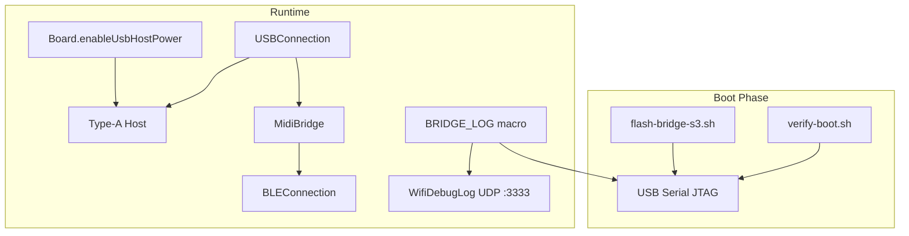

# Piano BLE Bridge — Full Stack Milestone Design

**Date:** 2026-05-31  
**Status:** Implemented

## Summary

One milestone covering flash/boot verification tooling, USB host MIDI re-enablement, Wi-Fi UDP debug logging, and Omocha-inspired USB transport hardening — without replacing the existing `Transport` architecture.

## Problem

1. Flash uploads failed when serial port was held open; post-flash download mode left a blank display.
2. `usbMidi.begin()` was disabled for serial diagnostics.
3. After `USB_SEL` switches D+/D− to the host port, native USB CDC is unavailable — Wi-Fi logging is required for keyboard testing.

## Architecture



## Phase 1 — Flash and boot verification

- **`scripts/verify-boot.sh`**: waits for `usbmodem`, captures 15s serial, checks for LCD/canvas markers, rejects download mode and PSRAM errors.
- **`scripts/flash-bridge-s3.sh`**: port-busy guard, post-flash `esptool run`.
- **`read_serial.py`**: download-mode hints, `--reset`, DTR/RTS low.
- Docs aligned in `docs/build.md` and `firmware/bridge-s3/README.md`.

## Phase 2 — USB host MIDI

- `Board::enableUsbHostPower()` moved out of display init; called from `USBConnection::begin()` after `usb_host_install`.
- `usbMidi.begin(board)` restored in `bridge-s3.ino`.

## Phase 3 — Wi-Fi debug

- `WifiDebugLog.h/.cpp` with `ENABLE_WIFI_DEBUG` (default 0 in `RTPMidiConfig.h`).
- `BridgeLog.h` — `BRIDGE_LOG` / `BRIDGE_LOG_LN` mirror to Serial + UDP broadcast on port 3333 when Wi-Fi STA is up.
- `scripts/wifi_log.py` — host-side receiver.

## Phase 4 — Omocha cherry-picks

Applied to `USBConnection` (MIT attribution in file header):

| Pattern | Implementation |
|---------|----------------|
| Dual IN transfers | `midiInTransfers[2]`, both submitted on connect |
| Queued batched OUT | `xQueueCreate(128 × 4 bytes)`, `processMidiOutQueue()` |
| Typed descriptors | `usb_intf_desc_t`, `usb_ep_desc_t` walk in `_parseConfig` |
| Preserved | Vendor 0xFF warning, 0x81 fallback, Casio delay, core-0 USB task |

## Verification

```bash
./scripts/flash-bridge-s3.sh
./scripts/verify-boot.sh
python3 read_serial.py --reset
# With ENABLE_WIFI_DEBUG=1 and Wi-Fi provisioned:
python3 scripts/wifi_log.py
```

## Out of scope

- Replacing `USBConnection` with external Omocha library
- OTA / UI changes beyond existing toast paths

## References

- [esp32-usb-host-midi-library](https://github.com/enudenki/esp32-usb-host-midi-library) (Omocha, MIT)
- [ESP32-S3 flash/display bring-up](../../solutions/integration-issues/esp32-s3-usb-otg-flash-display-bringup.md)
